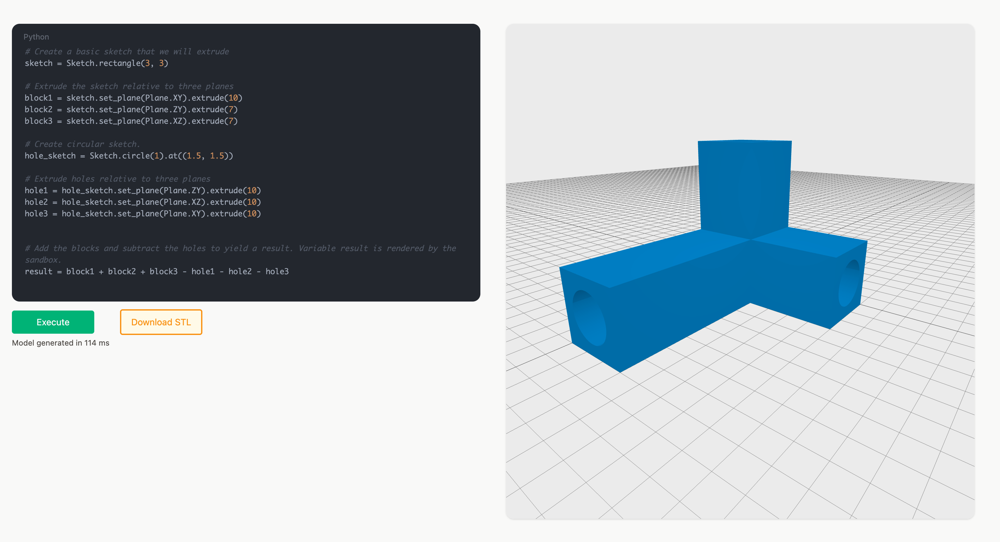

# Machina

Machina is CAD software with a code interface. It stems from frustration with using expensive and complex software tools to create and design simple objects to print on my 3D printer. Machina will be an opensource python library that will allow scriptable parametric design in the spirit of existing solutions like CadQuery, OpenSCAD, FreeCAD, etc. Defining objects in code will unlock automation (build pipelines), LLM interfacing and easy diff-inspection. Crucial to cad software is the geometric kernel, Machina is built upon the excellent [Manifold](https://github.com/elalish/manifold) library that is [100-1000x](https://elalish.blogspot.com/2022/03/manifold-performance.html) faster than other open source kernels.

[Demo here](https://machina.autnms.com/)

## Status
For now Machina is very alpha and very 'work in progress'.